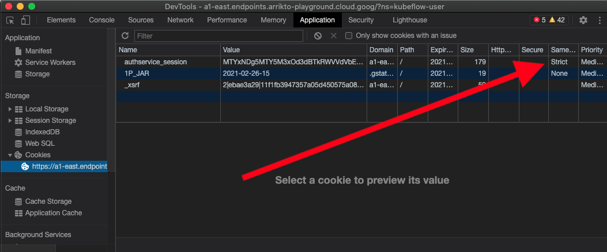
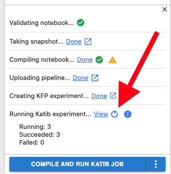

# Demo: COVID-19 Vaccine: mRNA Degradation Prediction w/Serving

## Overview

Demo preptime: 60 mins **minimum**

Demo runtime: 10 mins

This demo showcases:
- JWA: Self-service notebook provisioning for end users (data scientists/data engineers)
- Kale UI: Kale automation for pipeline creation and hyperparameter optimization with Katib via Kale UI
- Rok: Automated snapshotting for each pipeline step
- KFServing: Self-service deployment of models by end users; Models UI features for logging and monitoring.
- Rok Registry: Portability of complete environments to enable internal or external collaboratoration.

## Prerequisites

This demo assumes you have access to an instance of Rok Registry to which you can connect new Roks and publish/subscribe to buckets. If you do not have a Rok Registry instance, simply skip any steps that refer to Rok Registry.

## Pre-demo preparation

1. Create 2 instances of MiniKF, each in a different GCP region.
1. Cluster 1 and Cluster 2: Once fully deployed, log in to both instances and change cookie to remove `Strict`. This is required to prevent an auth infinite loop when connecting to Registry.
    - On Chrome, right click on the Kubeflow UI and select "Inspect".
    - Select the "Application" tab from the DevTools window that opens.
    - In the Storage section in the left navigation bar, open the Cookies folder.
    - Select the cookie for your instance.
    - Double click the "SameSite" column for the `authservice_session` cookie, then hit backspace and enter. 
    - Refresh the page and confirm that hthe SameSite column remains blank.
    - 
1. Cluster 1: Launch a new notebook server called `vaccine-demo `using the custom image below:
    - `tbaums/vaccine-demo-del:6a557e9-202103091003`
1. Cluster 1: Launch a second new notebook server called `vaccine-serve` using the custom image below:
    - `tbaums/vaccine-demo-del:6a557e9-202103091003`
1. Cluster 1: Create a new published Rok bucket called `vaccine-shared` and complete connect and publish process with your Registry instance.
1. Cluster 1: Connect to the `vaccine-serve` notebook server 
    - Open `vaccine-degradation-serve.ipynb` notebook file from the file browser on left.
    - Select "Run" from the top menu, then "Run all cells."
1. Cluster 1: Connect to the `vaccine-demo` notebook server
    - Open `vaccine-degradation.ipynb` notebook file from the file browser on left.
    - Open Katib Jupyter extension.
    - Click "Enable" toggle.
    - Click "Compile and run Katib job"

## Demo script

1. Begin from the home UI and click Notebooks tab.
1. Explain that notebook environments are completely self-service and customizable for data scientists.
1. Connect to the `vaccine-demo` notebook.
1. Explain that this notebook attempts to predict sites most likely to suffer degradation in an mRNA molecule.
1. Click Kale tab in Jupyterlab notebook, and click Enable toggle.
1. Explain:
    - Kale enables data scientists/data engineers to create a pipeline by tagging cells.
    - There are different tags for different pipeline components.
    - Pipeline steps can have dependencies on other steps or specific resources like GPU.
    - Each pipeline step will be automatically snapshotted by Rok.
    - (Click "Configure Katib job") Each Katib experiment will be broken out into its own pipeline run for perfect reproducibility.
    - **Take a moment to ask the prospect to contemplate the alternative (ie, without Arrikto): much more effort and lost efficiency.**
1. Click "Compile and Run Katib Job"
1. Click "View Katib Experiment" 
    - 
1. Explain to the prospect that you ran the experiment ahead of time to show the final result and navigate to the experiment that was created in your first run of `vaccine-degradation.ipynb` during the demo setup.
1. Explain:
    - The Katib UI as displaying the results from training with different hyperparameters.
    - Each trial is a separate pipeline and therefore can see a Rok snapshot from any step of any trial.
1. Click the pipeline icon for the trial with the lowest loss.
1. From the Pipeline UI, show and explain:
    - Each step of the pipeline is snapshotted and has a unique Rok url that you can then use to recreate the environment and the data exactly as it looked at that moment in time. 
      - Click a Rok snapshot link from the "Visualizations" tab to show the prospect the Git-like nature of Rok snapshots and how to grab the Rok url.
    - Kale will automatically use a common Rok snapshot for all identical steps in a Katib experiment. This saves a **huge** amount of compute resources vs alternatives.
1. Now that we have our optimized model, we want to serve it. From the Models UI, click the deployed model. 
1. Show and explain:
    - Model deployed directly by the data scientist from a notebook.
    - Models are deployed using KFServing which automatically scales the endpoint out and in based on traffic.
    - Show the complete integrated monitoring.
    - Show the Logs tab and show the model actively making predictions.
1. To continue to improve our model, we want to be able to share our work with collaborators. Click the Snapshots tab.
1. Show and explain:
    - Show the published `vaccine-shared` bucket.
    - Click snapshots tab and show and explain the snapshotting of the `vaccine-demo` environment.
    - Move to Cluster 2 and show that it is a fresh environment in a different region.
    - Click snapshots tab and create a new bucket called `vaccine-subscribed`
    - Connect the new bucket to the Registry and show auth flow.
    - Once connected, show the `vaccine-subscribed` bucket downloading data from Cluster 1 and explain the peer-to-peer model of Rok registry.
    - Note the flexibility and power of Rok and Rok Registry to enable true data mobility in addition to reproducibility.

<!-- ## Footnotes -->

